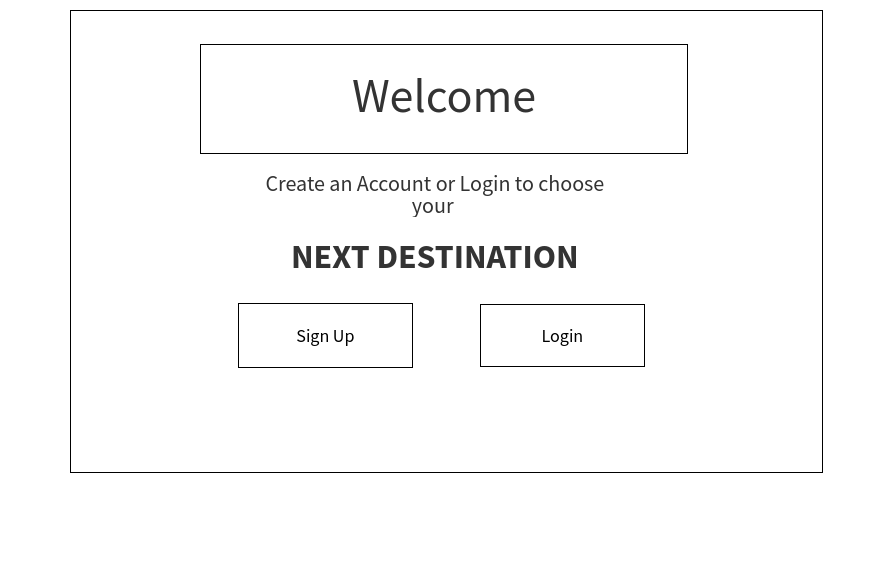
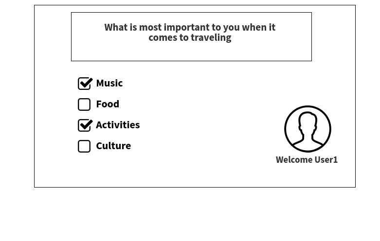
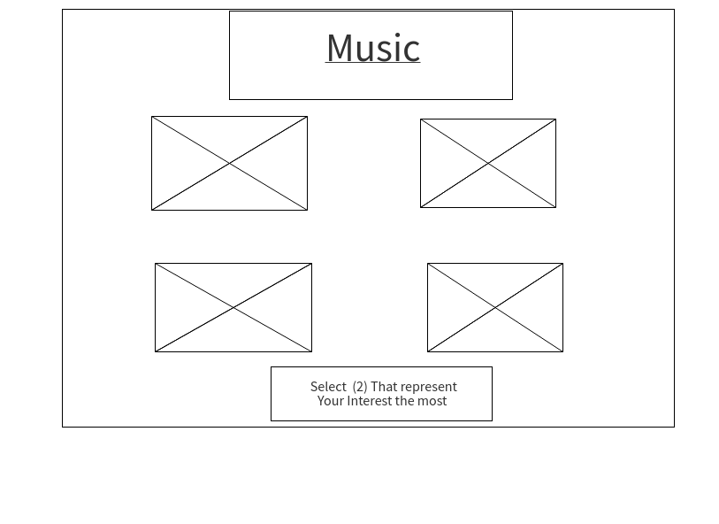
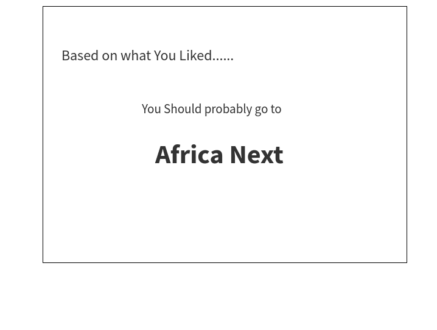

### solo-Project2

# Find Your Next Destination

### Overview
A web page that helps you decide where you should travel to next based on pictures you find amazing and things you like to do.

### Wireframes 

### User stories 

* when you open the page you are asked to login
* when you login or sign up you a taken to the next page where you are asked to choose what is most important to you 
* After selection you are asked to select images that best suite your interest 
* At the end of the page your are recommended where you should probably go next based on the images and options you selected 

### MVP Checklist 

* user can loging or signup 
* user can select what is most important to them
* user is given options of pictures to select from 
* you are recommended a place at the end 

### streach Goals 

* user can upload profile picture 
* user gets random photos each time they want to choose a part
* it gives the user recommended countries to go as well
* user is showing their top 2 choices and asked more question to help finalize 